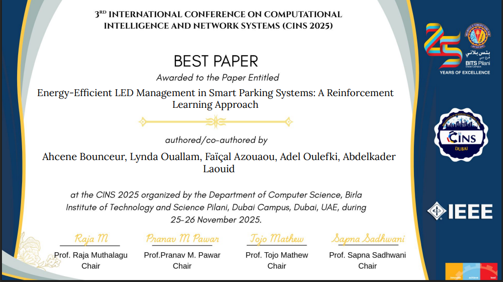
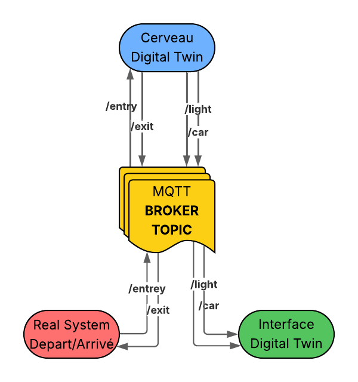
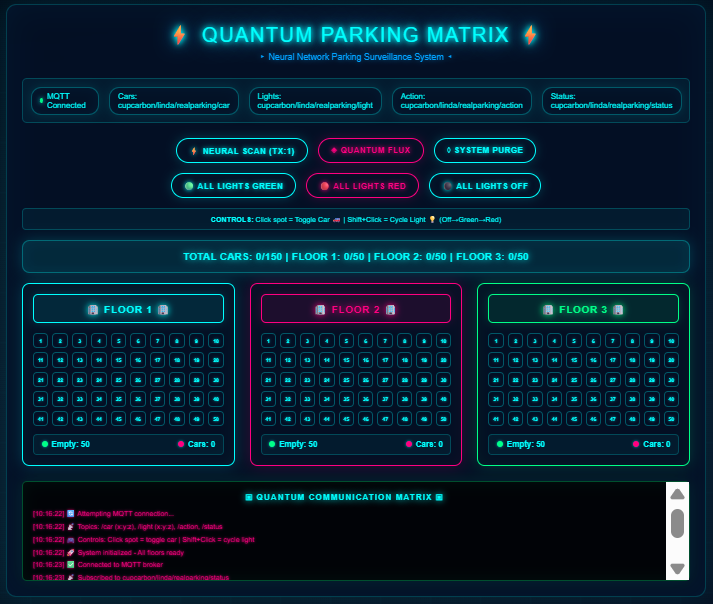
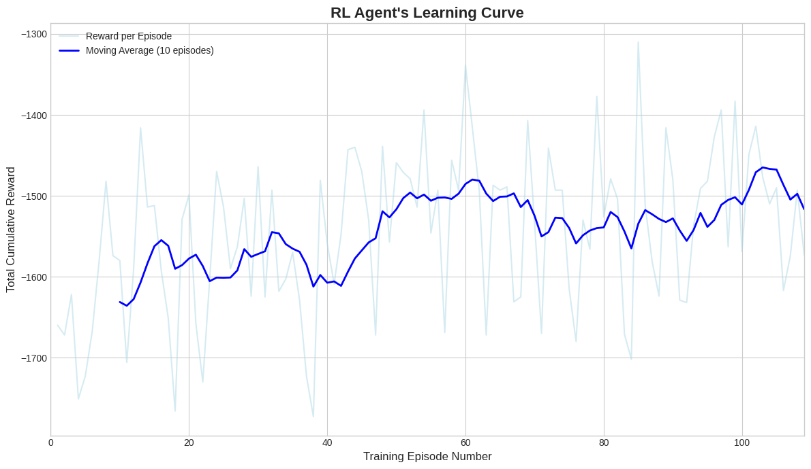
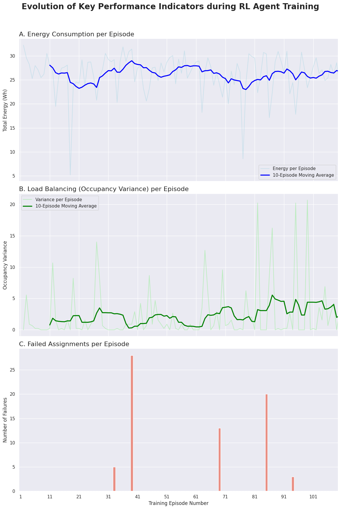
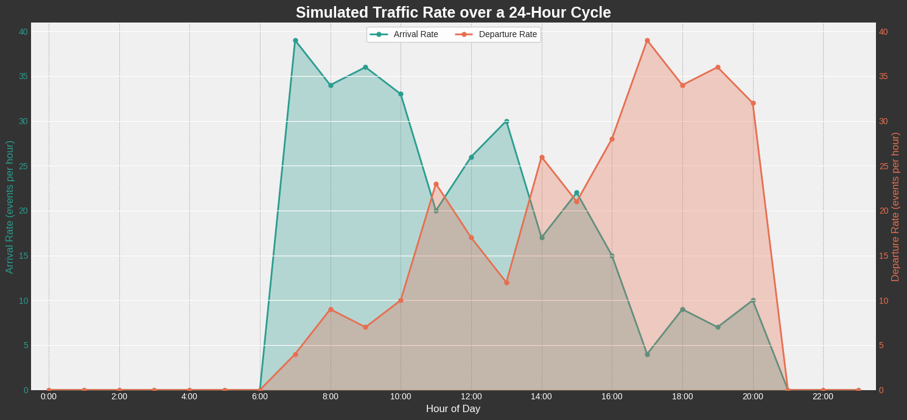
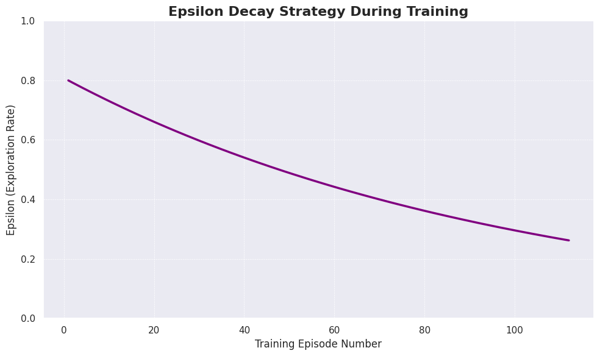
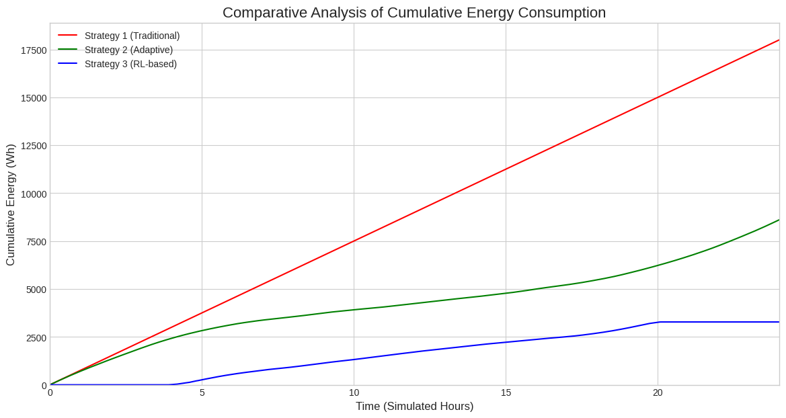
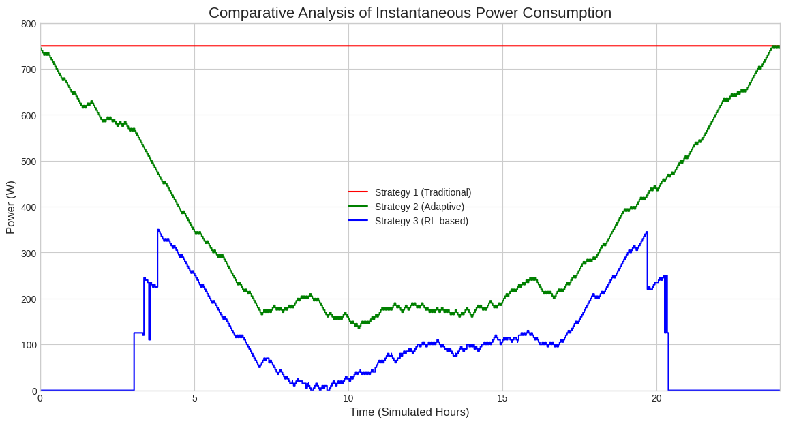

# 🏗️ Intelligent Digital Twin for Smart Parking Optimization

> **Final Year Project (PFE) | Engineer's Degree Dissertation**
> This repository presents an award-winning **Intelligent Digital Twin** designed to solve the energy inefficiency of urban parking guidance systems using **Deep Reinforcement Learning**.

---

## 🏆 Honors & Awards
This research was recognized for its innovation and impact:
- 🌟 **BEST PAPER AWARD** at the 3rd International Conference on Computational Intelligence and Network Systems (**CINS 2025**), Dubai, UAE.
- 📄 **Official Publication:** [Read the full paper on IEEE Xplore](https://ieeexplore.ieee.org/document/11412248)

---

## 📌 Project Overview
Modern smart parkings use LED-based guidance systems that consume massive amounts of energy. This project introduces a **proactive Digital Twin** orchestrated by a **Reinforcement Learning (RL)** agent.

### 🚀 Key Performance Results
- **81.8% Energy Reduction:** Achieved by learning an optimal load-balancing policy that keeps infrastructure in "standby mode" for as long as possible.
- **60% Search Time Optimization:** Improved user experience through intelligent vehicle distribution.

---
## 🎮 Live Interactive Simulation (Sandbox)
I developed a standalone web-based simulator to demonstrate the energy logic of the 4 different scenarios. No installation is required.

👉 **[Launch Live Simulation](https://Lynda7.github.io/intelligent-digital-twin-smart-parking/web-simulation/)**

### 🧪 Scenarios Compared:
1. **Always-On:** Traditional full-power mode.
2. **Green Only:** Reactive mode (lights only for free spots).
3. **Smart Threshold:** Agent activates lights only if floor occupancy > 50%.
4. **Advanced Balancing:** Optimized floor selection based on real-time flow.

## 🌐 System Architecture
The project features a decoupled architecture ensuring real-time synchronization between the virtual model and the physical simulation.

### 🎨 Digital Twin Interface
The "Quantum Parking Matrix" is a high-fidelity web dashboard (HTML/CSS/JS) that visualizes 150 parking spots and AI decisions in real-time via **MQTT**.

---

## 🧠 AI Core: Reinforcement Learning (DQN)
The agent (Deep Q-Network) learns to assign vehicles to specific floors to minimize energy-intensive states while maintaining service quality.

### 📊 Performance Metrics
| Learning Convergence | Training KPIs Evolution |
|:---:|:---:|
|  |  |
| *Stable convergence achieved after 80 episodes* | *Drastic reduction in variance and failures* |

---

## 📊 Performance Analysis & Experimental Results

The effectiveness of the Intelligent Digital Twin was evaluated through a rigorous 24-hour simulation, comparing three distinct management strategies.

### 📥 1. Simulation Context
To mirror real-world conditions, we modeled a stochastic diurnal traffic cycle representing a typical urban business area, featuring morning and evening peak hours.

### 🧠 2. Learning Strategy (Epsilon-Greedy)
The agent uses an **Epsilon-Decay strategy** to manage the exploration-exploitation trade-off. It starts by exploring the parking environment and gradually transitions to exploiting its learned knowledge for optimal vehicle assignment.

### ⚡ 3. Energy Impact Comparison
Our RL-based strategy (blue) was compared against the "Always-On" baseline (red) and the "All-Green" heuristic (green).

| Instantaneous Power Demand (W) | Cumulative Energy Consumption (Wh) |
|:---:|:---:|
|  |  |
| *Real-time adaptation to traffic* | *Final 81.8% efficiency gain* |

**Key Finding:** While the heuristic approach reduces waste, only the Reinforcement Learning agent manages to keep the infrastructure in "standby mode" during low-traffic periods, leading to a massive **81.8% energy saving**.

## 📁 Repository Structure
- **`/docs`**: Full dissertation report and Best Paper Award documentation.
- **`/rl-engine`**: Python scripts and Jupyter Notebooks for agent training and traffic simulation.
    - Includes `q_table_final.pkl`: The pre-trained brain of the system.
- **`/ui-digital-twin`**: Source code of the interactive Web Dashboard.
- **`/screenshots`**: Full gallery of research results and UI previews.

## 🛠 Tech Stack
- **AI/ML:** Python 3.9+, Scikit-Learn, NumPy, Pandas.
- **IoT/Network:** MQTT (EMQX), Paho-MQTT, MQTT.js.
- **Frontend:** HTML5, CSS3 (Modern Dark UI), JavaScript.
- **Orchestration:** n8n Workflows.

---
*Developed by Lynda OUALLAM - Academic Year 2024/2025.*  
*Supervised by Dr. Ahcene BOUNCEUR & Pr. Faïçal AZOUAOU.*